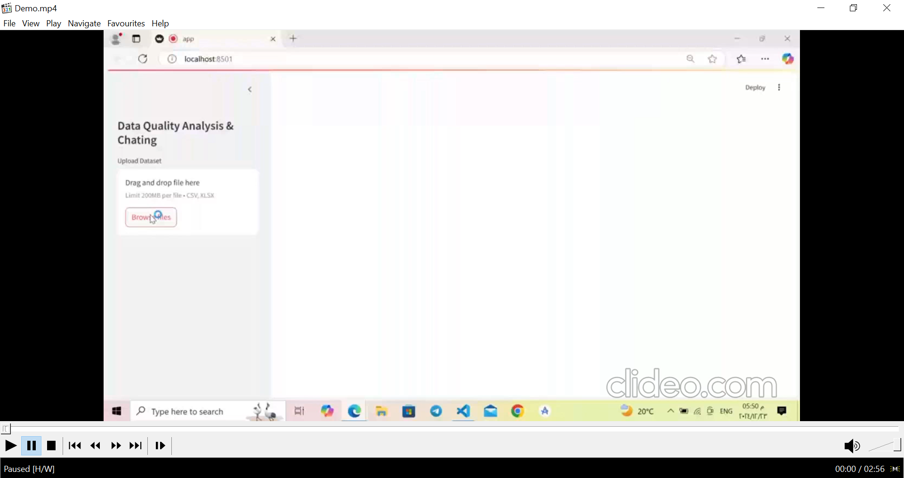

# Smart Cleanse
Data Quality Analysis and Cleaning Tool

## Demo Video

[](assets/Demo.mp4)

🌟 Overview  
This project is a Streamlit-based interactive tool designed to assist in exploring, cleaning, and analyzing datasets. Whether you're dealing with Excel (.xlsx) or CSV files, this tool provides a user-friendly interface for performing common data quality tasks, advanced transformations, and exploratory data analysis (EDA).

✨ Features  
1. Data Exploration  
   - Upload .xlsx or .csv datasets.  
   - View the dataset: Quickly inspect the data.  
   - Get dataset info: View details about columns, data types, and memory usage.  
   - Descriptive statistics: Summarize your data with measures like mean, median, standard deviation, etc.  
2. Data Transformation  
   - Rename columns to make them more meaningful.  
   - Convert column data types to suit your needs.  
3. Handle Missing Values  
   - Automatically identify missing values in the dataset.  
   - Choose how to handle missing data:  
     - Drop rows/columns.  
     - Fill with mean, median, or mode.  
4. Handle Duplicates  
   - Detect and remove duplicate rows to ensure data consistency.  
5. Outlier Detection & Handling  
   - Identify outliers using statistical methods.  
   - Choose how to address them (e.g., removal or replacement).  
6. Data Visualization  
   - Select columns to visualize with various chart options.  
   - Display the correlation matrix to analyze relationships between variables.  
7. Interactive RAG (Red-Amber-Green) Assistant  
   - An integrated AI chatbot (powered by Ollama) for querying your dataset.  
   - Ask questions about your dataset to gain insights and recommendations.  
8. Download Cleaned Dataset  
   - After making transformations and cleaning the data, download the updated dataset for further use.

🔧 Installation  
Clone this repository:
1. Clone the repository:
```
git clone https://github.com/Shahd-Elkarn/smart_cleanse.git 
cd smart_cleanse
```

2. Create a Virtual Environment:
```
python -m venv venv
 ```

3. Activate the Virtual Environment:
   - Windos :
   ```
   venv\Scripts\activate
   ```

   - macOS/Linux :
   ```
   source venv/bin/activate
   ```

4. Install Required Packages:
```
pip install -r requirments.txt
```

5. Run the Streamlit Application:
```
streamlit run app.py
```


  


